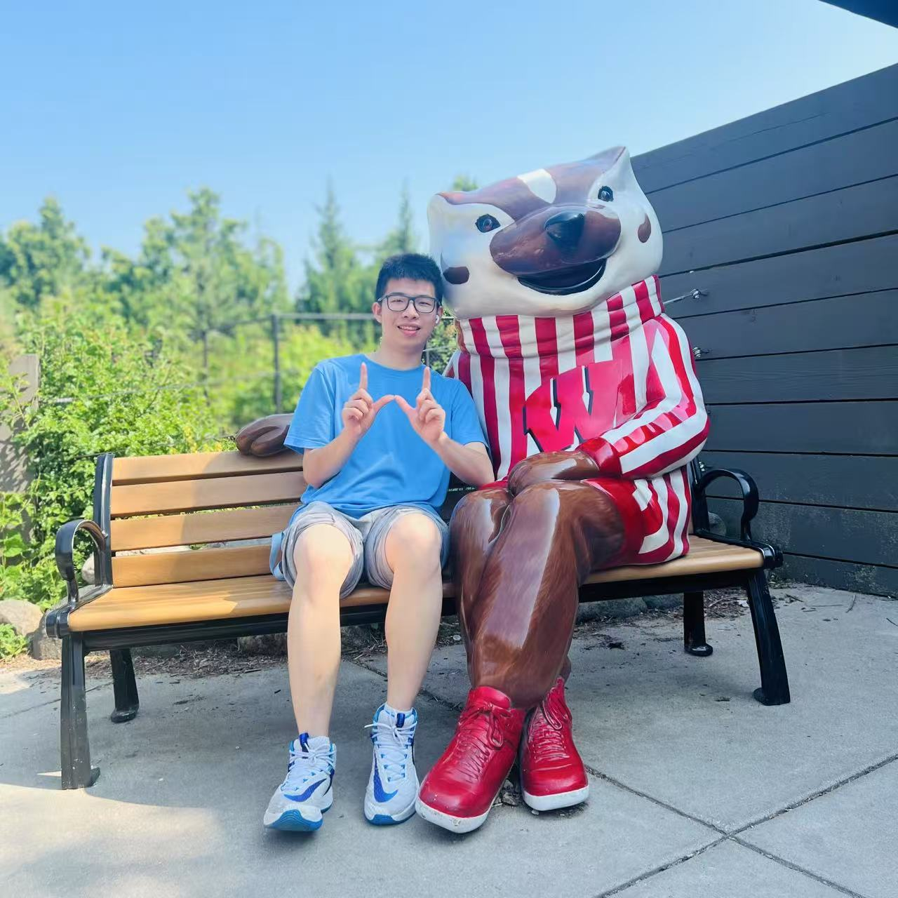

<h2 align="center">🎉 About Me</h2>

- 👋 Hi, I'm **Yixi (Xander) Zhou**.
- 🎓 I'm a **Computer Science Ph.D. student** at [Hong Kong Baptist University](https://www.hkbu.edu.hk/).
- 🔍 My research focuses on **data agents and reliable LLM-based systems**, with interests in retrieval, structured reasoning, and trustworthy evaluation for data management and analytics.
- 🛠️ My recent work spans **financial document QA, Text-to-SQL evaluation, and adaptive data discovery**.
- 🤝 I also work on **financial AI** with collaborators at [MBZUAI](https://mbzuai.ac.ae/) and [The University of Tokyo](https://www.u-tokyo.ac.jp/en/).
- 🌱 I received my B.S. from **ShanghaiTech University** and was an exchange student at **UW–Madison**.
- 🏡 Visit my [personal website](https://xanderzhou2022.github.io/) for publications, projects, and updates.
- 📫 Reach me at [yxzhou@comp.hkbu.edu.hk](mailto:yxzhou@comp.hkbu.edu.hk) · [Google Scholar](https://scholar.google.com/citations?user=3oc8NLcAAAAJ) · [LinkedIn](https://www.linkedin.com/in/yixizhou2022/).

 
 

<picture>
  <source media="(prefers-color-scheme: dark)" srcset="https://raw.githubusercontent.com/XanderZhou2022/xanderzhou2022/output/github-snake-dark.svg" />
  <source media="(prefers-color-scheme: light)" srcset="https://raw.githubusercontent.com/XanderZhou2022/xanderzhou2022/output/github-snake.svg" />
  
</picture>
